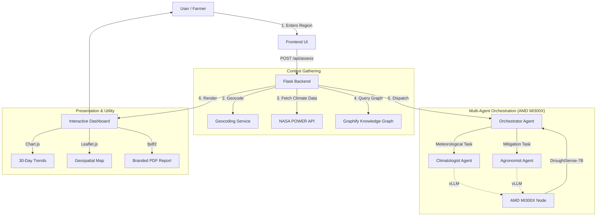

# 🏗 Architecture & Technical Documentation

This document provides a technical deep-dive into the architecture of **DroughtSense AI**, highlighting our unique multi-agent workflow and fine-tuned model infrastructure.

---

## 🗺 System Architecture Diagram



---

## 🧩 Component Breakdown

### 1. Multi-Agent Workflow (The Differentiator)
Instead of a single zero-shot prompt, the system employs a multi-agent framework:
- **Climatologist Agent:** Interprets NASA data and Graphify context to calculate precise meteorological risk.
- **Agronomist Agent:** Uses the Climatologist's output to generate hyper-local, actionable farming recommendations.
- **Orchestrator Agent:** Manages the flow and ensures the final output strictly adheres to the required JSON schema.

### 2. AI Inference (The Moat)
- **Tech:** AMD Developer Cloud, MI300X GPU, ROCm, vLLM.
- **Model:** A **Custom Fine-Tuned** Meta Llama 3.1 8B Instruct model.
- **Why Fine-Tuning?** General models (like ChatGPT) provide generic advice. By fine-tuning the model on agricultural papers, regional crop vulnerability datasets, and drought mitigation tactics, our model possesses hyper-specific domain knowledge.

---

## 🧠 Prompt Engineering Strategy

The success of DroughtSense AI relies on strict prompt engineering to force the LLM to output usable, structured data rather than conversational text.

### System Prompt (Persona & Constraints)
```text
You are an expert agricultural and climatology AI assistant.
Your goal is to analyze recent climate data for a specific region and determine the drought risk level.
You must output YOUR ENTIRE RESPONSE as a valid, parsable JSON object.
Do not include markdown blocks, pleasantries, or any text outside of the JSON object.

JSON Schema:
{
  "risk_level": "Low" | "Medium" | "High" | "Critical",
  "explanation": "A plain language explanation (2-3 sentences) of why this risk level was assigned based on the data.",
  "recommendations": [
    "Actionable tip 1",
    "Actionable tip 2",
    "Actionable tip 3"
  ]
}
```

### User Prompt (Dynamic Data Injection)
```text
Analyze the drought risk for {Region Name}.
Recent Data (Last 30 days):
- Average Temperature: {avg_temp}°C
- Cumulative Precipitation: {total_precip} mm
- Soil Moisture Index: {soil_moisture}

Provide your assessment in the requested JSON format.
```

---

## 🔌 API Integrations

### NASA POWER API
- **Endpoint:** `https://power.larc.nasa.gov/api/temporal/daily/point`
- **Parameters:** `parameters=PRECTOTCORR,T2M,GWETROOT`, `community=AG`, `longitude={lon}`, `latitude={lat}`, `start={start_date}`, `end={end_date}`, `format=JSON`.
- **Note:** Free to use, no API key required, highly reliable for historical and near-real-time agroclimatology data.

## 🚀 Deployment Strategy
1. **AMD Droplet:** Left running during the hackathon period, exposing the vLLM port (e.g., 8000) securely (via IP whitelisting or bearer tokens).
2. **Web App:** Deployed on **Railway.app** as a standard Python WSGI web service (using `gunicorn`). 
3. **Environment Secrets:** The deployed Web App holds the `AMD_VLLM_BASE_URL` and `AMD_VLLM_API_KEY` to authenticate against the MI300X instance.
