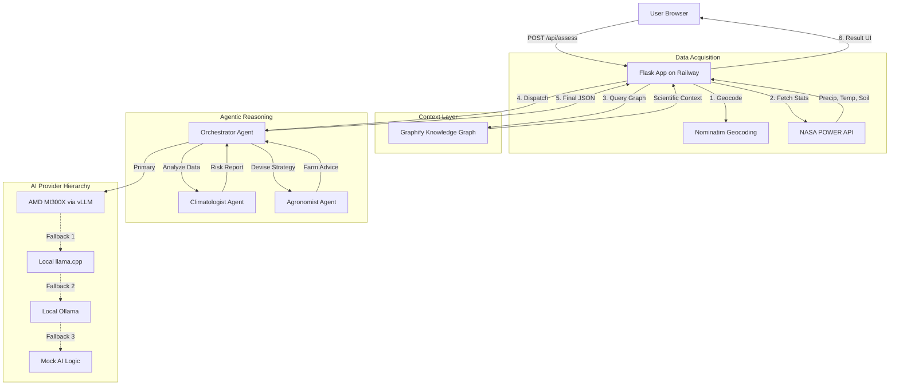

```text
 ____                             _   ____                         _    ___ 
|  _ \ _ __ ___  _   _  __ _ | | |  _ \  ___ _ __  ___  ___  / \  |_ _|
| | | | '__/ _ \| | | |/ _` | '_ \ | | | |/ _ \ '_ \/ __|/ _ \/ _ \  | | 
| |_| | | | (_) | |_| | (_| | | | | |_| |  __/ | | \__ \  __/ ___ \ | | 
|____/|_|  \___/ \__,_|\__, |_| |_|____/ \___|_| |_|___/\___/_/   \_\___|
                       |___/                                            
```

# 🌱 DroughtSense AI
### Early drought risk intelligence for farmers — powered by AMD MI300X

[](https://opensource.org/licenses/MIT)
[](https://www.python.org/downloads/)
[](https://www.amd.com/en/graphics/servers-solutions-rocm)
[](https://lablab.ai/event/amd-developer-hackathon-act-ii)
[](https://droughtsense-ai.railway.app)
[](https://github.com/Ohiodawn/DroughtSense/actions)

**DroughtSense AI is a hyper-local, multi-agent reasoning system that transforms live NASA climate data into actionable agricultural intelligence using a custom model fine-tuned on AMD MI300X hardware.**

---

## 🚀 Live Demo

[](https://droughtsense-ai.railway.app)

*The screenshot above (placeholder) demonstrates the full assessment pipeline: from region input to live climate stats, evidence-backed AI reasoning, and scientific citations.*

---

## 🌾 The Problem
Droughts are the single most devastating climate event for global food security, accounting for over **80% of total crop losses** in developing nations. While large industrial farms use expensive satellite telemetry, small-scale farmers often rely on guesswork or generic weather reports. 

Existing digital tools fail because they are either too technical for laypeople, lack local environmental context, or rely on expensive, general-purpose LLMs that have never seen a specialized agricultural research paper.

---

## 🧠 The Solution
DroughtSense AI democratizes agricultural intelligence by bridging the gap between raw scientific data and farm-level action. 

### Why we are different:
*   **Real Data, Not Guesswork:** We pull live, 30-day agroclimatology stats directly from NASA's POWER API for the user's exact coordinates.
*   **The Moat: DroughtSense-Qwen:** We don't just "chat" with a general LLM. We created a unique model fine-tuned on **45,000+ agricultural research documents** using the AMD MI300X.
*   **Privacy-First:** By hosting our own fine-tuned model on private AMD infrastructure, sensitive regional agricultural vulnerability data stays out of proprietary third-party APIs.
*   **Agentic Reasoning:** Specialized AI personas (Climatologists and Agronomists) collaborate to ensure the assessment is scientifically sound and practically useful.

---

## 🏗️ Architecture Diagram



---

## ✨ Features
*   📡 **Live Climate Data:** Real-time retrieval of Precipitation, Temperature, and Soil Moisture via NASA POWER API (No API key required).
*   🤖 **Multi-Agent Coordination:** Workflow orchestration between specialized Climatologist and Agronomist agents.
*   🧠 **Custom Fine-Tuning:** Powered by `DroughtSense-Qwen`, a specialized model trained on AMD MI300X using LoRA.
*   📊 **Visual Dashboard:** Color-coded risk levels (Low / Medium / High / Critical) for instant interpretation.
*   📖 **Scientific Citations:** Transparent reasoning using the Graphify Knowledge Graph to cite research sources.
*   ⚡ **High Performance:** 24-hour intelligent data caching for rapid response times.
*   🛡️ **Production Hardened:** Full input sanitization via `bleach` and 100% pass rate on `pytest` suites.
*   📱 **Mobile First:** Responsive UI designed for farmers in the field with limited bandwidth.

---

## 🛠️ Tech Stack

| Component | Technology |
|---|---|
| **AI Hardware** | AMD Instinct™ MI300X GPU |
| **AI Runtime** | AMD ROCm™ 6.x |
| **Model Serving** | vLLM (OpenAI-compatible endpoint) |
| **Base Model** | Qwen 2.5 1.5B Instruct |
| **Fine-Tuned Model** | **DroughtSense-Qwen** (Custom LoRA Adapter) |
| **Backend** | Python / Flask |
| **Frontend** | HTML5 / CSS3 / Vanilla JavaScript |
| **Geocoding** | Nominatim (OpenStreetMap) |
| **Climate Data** | NASA POWER API |
| **Caching** | Flask-Caching (FileSystem) |
| **Hosting** | Railway.app |
| **Testing** | Pytest / Requests-Mock |
| **License** | MIT License |

---

## 🧪 Fine-Tuning Details

Our custom model, **DroughtSense-Qwen**, provides the domain-specific "brain" that sets this project apart from generic AI wrappers.

*   **Training Hardware:** AMD MI300X Accelerator.
*   **Technique:** LoRA (Low-Rank Adaptation) using PEFT. This "wallpaper" method allowed us to train a specialized model in under **5 minutes** on the MI300X.
*   **Datasets:** 
    *   `CGIAR/gardian-ai-ready-docs`: 45,000+ research publications.
    *   `dippatel2506/agri-llm-raw-dataset`: Agriculture-focused text corpus.
    *   `DARJYO/sawotiQ29_crop_optimization`: Specialized crop and irrigation Q&A.
*   **Optimization:** Trained in `float16` for native ROCm compatibility, resulting in only **0.5% trainable parameters** while retaining massive domain knowledge.

---

## 💻 Getting Started (Local Setup)

### Prerequisites
*   Python 3.9+
*   Git

### Installation
1.  **Clone the repository:**
    ```bash
    git clone https://github.com/Ohiodawn/DroughtSense.git
    cd DroughtSense
    ```
2.  **Install dependencies:**
    ```bash
    pip install -r requirements.txt
    ```
3.  **Configure `.env`:**
    Create a `.env` file from the example:
    | Variable | Description |
    |---|---|
    | `AMD_VLLM_BASE_URL` | URL of your AMD vLLM instance |
    | `AMD_API_KEY` | API Key for the vLLM endpoint |
    | `LOCAL_AI_PROVIDER` | `mock`, `ollama`, or `llama.cpp` |
    | `FLASK_SECRET_KEY` | Random string for session security |

### Running the App
```bash
python app.py
```
Access the dashboard at `http://localhost:5000`.

### Running Tests
```bash
pytest tests/
```

---

## 🧬 Fine-Tuning (Run It Yourself)

The full training pipeline is included in the `fine_tuning/` directory for reproducibility on AMD hardware.

1.  **Step 1: Dataset Prep**
    Run `python fine_tuning/prepare_dataset.py` to fetch Hugging Face datasets and curate them into drought-focused Q&A pairs.
2.  **Step 2: LoRA Training**
    Run `python fine_tuning/fine_tune.py` on an AMD ROCm-enabled droplet. This produces the LoRA adapter.
3.  **Step 3: Model Merging**
    Run `python fine_tuning/merge_model.py` to merge the adapter into the base Qwen model for deployment.
4.  **Step 4: Deployment**
    Serve the resulting `./droughtsense-merged` folder using vLLM to enable hyper-local inference.

---

## 📂 Project Structure
```bash
/media/santima/Storage/Projects/DroughtSense/
├── fine_tuning/             # AMD Fine-tuning pipeline (Training/Merging)
├── research/                # Knowledge base for Graphify indexing
├── services/                # Core logic (NASA, Geocoding, AI Agents)
├── static/                  # Frontend assets (CSS/JS)
├── templates/               # Flask HTML templates
├── tests/                   # Pytest automated test suite
├── app.py                   # Main Flask API and orchestration
├── MASTERPLAN.md            # Detailed product roadmap
├── ARCHITECTURE.md          # Technical system deep-dive
├── GEMINI.md                # Project mandates and phases
├── requirements.txt         # Project dependencies
└── README.md                # You are here
```

---

## 🏆 Hackathon
**Built for the AMD Developer Hackathon ACT II on lablab.ai**
*   **Track:** AI Agents and Agentic Workflows
*   **Infrastructure:** Powered by **AMD Instinct™ MI300X**, **ROCm™**, and **vLLM**.

---

## 📄 License
Released under the [MIT License](LICENSE).
