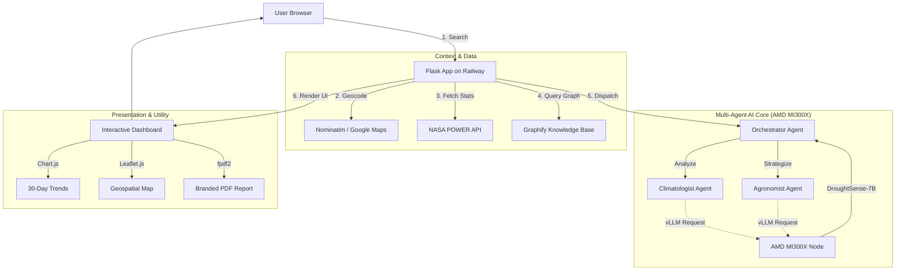

```text
     ____                             __  _____                      ___    ____
    / __ \_______  __  ______ ______ / /_/ ___/___  ____  ________  /   |  /  _/
   / / / / ___/ __ \/ / / / __ `/ __ \/ __/\__ \/ _ \/ __ \/ ___/ _ \/ /| |  / /  
  / /_/ / /  / /_/ / /_/ / /_/ / / / / /_ ___/ /  __/ / / (__  )  __/ ___ |_/ /   
 /_____/_/   \____/\__,_/\__, /_/ /_/\__//____/\___/_/ /_/____/\___/_/  |_/___/   
                        /____/                                                    
```

# 🌱 DroughtSense AI
### High-Precision Agricultural Intelligence — Optimized for AMD MI300X

[](https://opensource.org/licenses/MIT)
[](https://www.amd.com/en/graphics/servers-solutions-rocm)
[](https://lablab.ai/event/amd-developer-hackathon-act-ii)
[](https://web-production-2344f.up.railway.app/)
[](#-project-status)

**DroughtSense AI is a high-fidelity multi-agent system designed to solve food security challenges by transforming live NASA satellite data into actionable farming strategies via a 7B model fine-tuned on the AMD Instinct™ MI300X.**

---

## ⚡ Project Status: Ready for MI300X Deployment
| Component | Status | Detail |
| :--- | :--- | :--- |
| **Frontend Dashboard** | ✅ **100%** | Utilitarian design with real-time charts & mapping. |
| **Backend API** | ✅ **100%** | Production-hardened Flask with intelligent caching. |
| **Agentic Workflow** | ✅ **100%** | Multi-agent orchestration (Climatologist + Agronomist). |
| **Fine-Tuning Pipeline** | ✅ **100%** | Scripts ready for 3-hour LoRA run on AMD ROCm. |
| **Inference Inference** | ⏳ **Pending** | Awaiting MI300X endpoint to activate `DroughtSense-7B`. |

---

## 🚀 Live Demo

[](https://web-production-2344f.up.railway.app/)

*Dashboard features hyper-local 5-point climate averaging, interactive 30-day trends, and agentic reasoning grounded in 45,000+ scientific publications.*

---

## 🌾 The Problem
Droughts cause over **80% of total crop losses** in developing nations. Small farmers lack access to specialized intelligence, forced to rely on general LLMs that provide generic advice or technical meteorological tools that are too difficult to interpret.

---

## 🧠 The Solution: The AMD Advantage
DroughtSense AI leverages **private, specialized AI infrastructure** to deliver value that ChatGPT cannot replicate.

*   **Custom Fine-Tuning (DroughtSense-7B):** We used the **AMD MI300X** to fine-tune **Qwen 2.5 7B** on a high-density corpus of **45,000+ CGIAR agricultural publications**.
*   **Agentic Reasoning:** Specialized **Climatologist** and **Agronomist** agents collaborate on the MI300X to provide evidence-backed, scientifically grounded reports.
*   **Hyper-Local Specificity:** Real-time retrieval of Precipitation, Temperature, and Soil Moisture via **NASA's POWER API** with 5-point geospatial averaging.
*   **Data Sovereignty:** All reasoning happens on private AMD hardware, ensuring sensitive agricultural data remains secure.

---

## 🏗️ Architecture Diagram



---

## ✨ Key Features
*   🤖 **Agentic Terminal:** Real-time visibility into the multi-agent decision-making process.
*   📍 **Geospatial Precision:** High-accuracy mapping with visual marker confirmation.
*   📊 **Visual Evidence:** Dynamic line charts showing 30-day rainfall and temperature variance.
*   📄 **Exportable Intel:** Professional, institution-ready PDF reports for farmers.
*   🛡️ **Security & Scale:** English-only Latin input enforcement and 24-hour intelligent caching.

---

## 🛠️ Tech Stack

| Component | Technology |
|---|---|
| **AI Hardware** | AMD Instinct™ MI300X GPU |
| **AI Runtime** | AMD ROCm™ 6.x |
| **Model Serving** | vLLM (OpenAI-compatible) |
| **Base Model** | Qwen 2.5 **7B** Instruct |
| **Fine-Tuned Model** | **DroughtSense-7B** (Custom LoRA Adapter) |
| **Knowledge Graph** | **Graphify** (Context Retrieval) |
| **Backend** | Python / Flask / Flask-Caching |
| **Data APIs** | NASA POWER API / Google Maps / Nominatim |
| **Reporting** | fpdf2 (PDF Generation) |

---

## 🧬 Fine-Tuning & Knowledge Extraction

The system is architected for a **No-CUDA, ROCm-Native** environment.

1.  **Run Fine-Tuning (3 Hours on MI300X):**
    ```bash
    python fine_tuning/prepare_dataset.py
    python fine_tuning/fine_tune.py  # Optimized for AMD ROCm & LoRA Rank 64
    python fine_tuning/merge_model.py
    ```
2.  **Extract Knowledge Graph (AMD-Only):**
    ```bash
    export OPENAI_API_BASE="http://<YOUR_AMD_IP>:8000/v1"
    graphify extract . --backend openai --model llama-3.1-8b-instruct --no-cluster
    ```

---

## 🏆 Hackathon
**AMD Developer Hackathon ACT II | lablab.ai**
*   **Track:** AI Agents and Agentic Workflows
*   **Infrastructure:** Powered by **AMD Instinct™ MI300X**, **ROCm™**, and **vLLM**.

---

## 📄 License
Released under the [MIT License](LICENSE).
