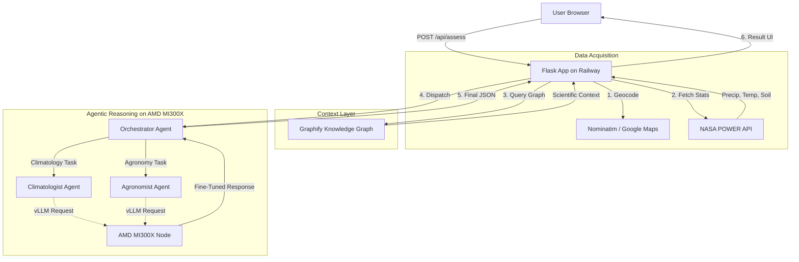

```text
 ____                             _   ____                         _    ___ 
|  _ \ _ __ ___  _   _  __ _ | | |  _ \  ___ _ __  ___  ___  / \  |_ _|
| | | | '__/ _ \| | | |/ _` | '_ \ | | | |/ _ \ '_ \/ __|/ _ \/ _ \  | | 
| |_| | | | (_) | |_| | (_| | | | | |_| |  __/ | | \__ \  __/ ___ \ | | 
|____/|_|  \___/ \__,_|\__, |_| |_|____/ \___|_| |_|___/\___/_/   \_\___|
                       |___/                                            
```

# 🌱 DroughtSense AI
### Early drought risk intelligence for farmers — powered by AMD MI300X

[](https://opensource.org/licenses/MIT)
[](https://www.python.org/downloads/)
[](https://www.amd.com/en/graphics/servers-solutions-rocm)
[](https://lablab.ai/event/amd-developer-hackathon-act-ii)
[](https://droughtsense-ai.railway.app)
[](https://github.com/Ohiodawn/DroughtSense/actions)

**DroughtSense AI is a hyper-local, multi-agent reasoning system that transforms live NASA climate data into actionable agricultural intelligence using an end-to-end open-source stack running exclusively on AMD hardware.**

---

## 🚀 Live Demo

[](https://droughtsense-ai.railway.app)

*The dashboard provides a real-time 5-point climate average, interactive 30-day trends, and agentic reasoning grounded in scientific research.*

---

## 🌾 The Problem
Droughts are the single most devastating climate event for global food security, accounting for over **80% of total crop losses** in developing nations. Existing digital tools fail because they are either too technical, lack local environmental context, or rely on expensive, closed-source LLMs that haven't seen specialized agricultural research.

---

## 🧠 The Solution
DroughtSense AI bridges the gap between raw scientific data and farm-level action by leveraging an **AMD-exclusive AI infrastructure**.

*   **Real Data:** Live, 30-day agroclimatology stats from NASA's POWER API.
*   **The Moat (DroughtSense-Qwen):** A unique model fine-tuned on **45,000+ agricultural research documents** using the AMD MI300X.
*   **Data Sovereignty:** By hosting our own fine-tuned model on private AMD infrastructure, sensitive regional food security data stays out of proprietary third-party APIs.
*   **Agentic Reasoning:** Specialized AI personas (Climatologists and Agronomists) collaborate on the MI300X to ensure assessments are scientifically sound and practically useful.

---

## 🏗️ Architecture Diagram



---

## ✨ Features
*   📡 **Live Climate Data:** Real-time retrieval of Precipitation, Temperature, and Soil Moisture via NASA POWER API.
*   🤖 **Multi-Agent Coordination:** Orchestrated workflow between specialized scientific agent personas.
*   🧠 **Custom Fine-Tuning:** Powered by `DroughtSense-Qwen`, a specialized model trained on AMD MI300X using LoRA.
*   📍 **Geospatial Precision:** 5-point radius averaging for large regions ensuring hyper-local accuracy.
*   📖 **Scientific Citations:** Transparent reasoning using the Graphify Knowledge Graph to cite research sources.
*   ⚡ **High Performance:** 24-hour intelligent data caching and AMD-accelerated inference.
*   📄 **Portable Reports:** Professional PDF generation for sharing with banks or aid agencies.

---

## 🛠️ Tech Stack

| Component | Technology |
|---|---|
| **AI Hardware** | AMD Instinct™ MI300X GPU |
| **AI Runtime** | AMD ROCm™ 6.x |
| **Model Serving** | vLLM (OpenAI-compatible endpoint) |
| **Base Model** | Qwen 2.5 1.5B Instruct |
| **Fine-Tuned Model** | **DroughtSense-Qwen** (Custom LoRA Adapter) |
| **Knowledge Graph** | **Graphify** (Extracted via AMD Backend) |
| **Backend** | Python / Flask |
| **Frontend** | HTML5 / CSS3 / Vanilla JavaScript |
| **Climate Data** | NASA POWER API |
| **Hosting** | Railway.app |
| **License** | MIT License |

---

## 🧪 Fine-Tuning Details

**DroughtSense-Qwen** was created to prove the power of private, specialized AI on AMD hardware.

*   **Hardware:** AMD MI300X Accelerator.
*   **Method:** LoRA (Low-Rank Adaptation) via PEFT.
*   **Datasets:** CGIAR Gardian Publications, Agri-LLM corpus, and Crop Optimization Q&A.
*   **Performance:** Trained in under **5 minutes** on the MI300X with native ROCm support.

---

## 🧬 Knowledge Graph Extraction (AMD-Only)

Unlike standard RAG, we use our **AMD-hosted model** to extract the Graphify knowledge graph from raw agricultural research, ensuring a completely private data pipeline.

```bash
# Point Graphify to your AMD Cloud instance
export OPENAI_API_BASE="http://<YOUR_AMD_IP>:8000/v1"
export OPENAI_API_KEY="not-needed"

# Extract knowledge using AMD hardware
graphify extract . --backend openai --model llama-3.1-8b-instruct --no-cluster
```

---

## 💻 Getting Started (Local Setup)

### Prerequisites
*   Python 3.9+
*   Access to an **AMD Developer Cloud** vLLM endpoint.

### Installation
1.  **Clone the repository:**
    ```bash
    git clone https://github.com/Ohiodawn/DroughtSense.git
    cd DroughtSense
    ```
2.  **Install dependencies:**
    ```bash
    pip install -r requirements.txt
    ```
3.  **Configure `.env`:**
    ```ini
    AMD_VLLM_BASE_URL="http://<YOUR_AMD_IP>:8000/v1"
    AMD_API_KEY="your-key"
    FLASK_SECRET_KEY="your-secret"
    ```

### Running the App
```bash
python app.py
```
Access the dashboard at `http://localhost:5000`.

---

## 🏆 Hackathon
**Built for the AMD Developer Hackathon ACT II on lablab.ai**
*   **Track:** AI Agents and Agentic Workflows
*   **Infrastructure:** Powered by **AMD Instinct™ MI300X**, **ROCm™**, and **vLLM**.

---

## 📄 License
Released under the [MIT License](LICENSE).
